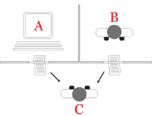

class: center, middle

## Artificial Intelligence

# Introduction

 

Gerard Escudero, 2020

 

.footnote[Source: [inverse](https://www.inverse.com/article/31467-artificial-intelligence-computer-human-game) ]

---
class: left, middle, inverse

# Outline

* .cyan[Artificial Intelligence]

* Game AI

* Content & Evaluation

* References & Tools

---

# Artificial Intelligence

#### .blue[Definitions]:

- an agent does tasks normally attached to humans (or animals)

- an agent has AI when it exhibits "smart" features:
  - learning, reasoning, behavior, reaction

#### .blue[Examples]:

- play chess

- reading license plates

- weather forecasting

---

# History

.cols5050[
.col1[
- Early Days: phylosofy 
[Turing test (1950)](https://en.wikipedia.org/wiki/Turing_test)

- 1950: symbolic era  
Knowledge set + resoning

- 1960: cybernetics  
biological (neural networks)

- 1966: crisis!  
ALPAC report against MT

- 1970: cybernetics (MLP)  
symbolic (Search Strategies, Uncertainty)

- 1980: real applications  
expert systems, fuzzy logic
]
.col2[

- 1990-2000: machine learning (statistical)

- 2010-: deep learning
]]

---
class: left, middle, inverse

# Outline

* .brown[Artificial Intelligence]

* .cyan[Game AI]

* Content & Evaluation

* References & Tools

---

# History

- 1980: *Pac-Man* (state machine)

- 1994: *Warcraft* (pathfinding)

- 1997: *Goldeneye 007* (sense simulation)

- 1997: *Creatures* (AI centered game)

- 1998: *Warhammer: Dark Omen* (formation motion)

- 1998: *Half-Life* (AI collaborators)

- 2000: *The Sims* (AI centered game)

- 2001: *Halo* (Decision Trees)

- 2001: *Black & White* (AI centered game)

- 2005: *F.E.A.R.* (GOAP)

- 2015: AlphaGo (Deep Learning)

---

# Game AI Model

---

# Game AI properties

*Building a game experience should be our main objective.*

.blue[The Complexity Fallacy]:  
- Select always the simplest way to give the illusion of complexity

- .blue[Occam's Razor]: the simplest explanation is most likely the right one

.blue[Perception window]:
- Interaction with agents lasts a very short time.

- Try to avoid commonsense behavioral changes  (see 2on video at references).

.blue[Memory & speed restrictions]

---
class: left, middle, inverse

# Outline

* .brown[Artificial Intelligence]

* .brown[Game AI]

* .cyan[Content & Evaluation]

* References & Tools

---

# Contents

.blue[Main concepts]:

- Movement (steering behaviours)

- Planning for movement (pathfinding)

- Decision Taking (behavior trees)

- Machine Learning (neural networks and deep learning)

- AI Game Design

.blue[Goals]:

- Game AI: common tools

- Unity & C#

---

# What we will learn?

- .blue[Steering Behaviours]
  - Wander & Hide
  - Flocking

- .blue[Navigation Mesh & Pathfinding]

- .blue[World Interface] (senses)

- .blue[Decision Making]
  - Behaviour Trees
  - Smart Objects & Planners

- .blue[Group tactical movement and decision taking]
  - Tactical group movement & Blackboards for information sharing
  - Behavior Trees for group coordination

- .blue[Machine Learning]
  - Deep Learning
  - Reinforced Learning

---

# Evaluation

.cols5050[
.col1[
#### .blue[1st assignment]
- Counts as 20%
- October 18th at 23:59
- Movement: steerings & pathfinding

#### .blue[2nd assignment]
- Counts as 20%
- November 22th at 23:59
- Behaviour: Behaviour Trees

#### .blue[3rd assignment]
- Counts as 25%
- December 22th at 23:59
- Machine Learning
]
.col2[
#### .blue[Assignment requirement]

- Work is in **teams of 2**

#### .blue[Innovation]
- Counts as 10%
- From 3 assignments

#### .blue[Final exam (theory)]
- Counts as 25%
- January 8th - 17th

#### .blue[Revaluation exam (Theory)]
- Counts as 25%
- Max grade is 5
- January 30th - February 5th
]]

---
class: left, middle, inverse

# Outline

* .brown[Artificial Intelligence]

* .brown[Game AI]

* .brown[Content & Evaluation]

* .cyan[References & Tools]

---

# References

- Ian Millington. *AI for Games (3rd ed)*. CRC Press, 2019.

## Tools

- Unity (personal edition)

- Github (private repositories)

---

# Homework

.blue[See next videos]:

- [Artificial Intelligence: Skyrim - The Elder Scrolls V](https://www.youtube.com/watch?v=WXd6CQRTNek). Ether Dynamics,
2013.

- [Stupidest AI Bug Contest 2011](https://www.youtube.com/watch?v=w1vKZwhLXkE). Masi84, 2011.

- [Top 10 Video Games with the Best AI](https://www.youtube.com/watch?v=1OXb8mg9IVw). WatchMojo.com, 2015.

- [MarI/O - Machine Learning for Video Games](https://www.youtube.com/watch?v=qv6UVOQ0F44). SethBling, 2015.

- [The wonderful and terrifying implications of computers that can learn](https://www.youtube.com/watch?v=t4kyRyKyOpo). Jeremy Howard, 2014.
