class: center, middle

## Artificial Intelligence

# Optimization for Games

<br>

Gerard Escudero & Samir Kanaan, 2019

<br>

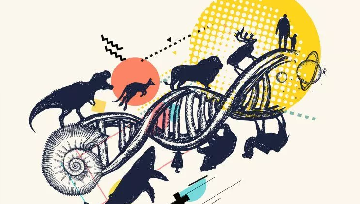

.footnote[[source](https://www.biologyonline.com/tutorials/genetics-and-evolution) ]

---
class: left, middle, inverse

# Outline

* .cyan[The Problem]

* Gradient Descent

* Genetic Algorithms

* Examples

* References

---

# The Problem

- **Problem**: setting parameters

- Example 1:

    - Strategy Game with diferent kind of units

    - Every unit have diferent attributes (attack, defense, life points)
 
    - All the units have to be useful

    - We need to balance them

- Example 2:

    - Game difficulty level adjustment

- Example 3:

    - Setting parameters of a Machine Learning algorithm

---

# Example

.cols5050[
.col1[
- **Problem**: Strategy Game

  - 10 unit types

  - 3 attributes (attack, defense, life)

  - 20 possible values (1..20)

  - possible combinations will be $20^{3\times 10}$

  - .blue[testing all combinations is impossible]
]
.col2[
- **Solution**: 

  - Find a _reasonably_ good solution in a limited time

  - .blue[Optimisation algorithms]

- .blue[The Curse of Dimensionality]
.center[
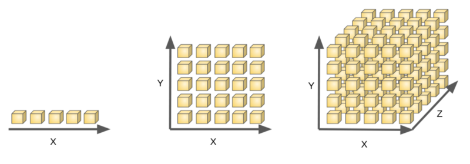
[source](https://www.freecodecamp.org/news/the-curse-of-dimensionality-how-we-can-save-big-data-from-itself-d9fa0f872335/)]

]]

---

# The Problem in Optimization

.center[
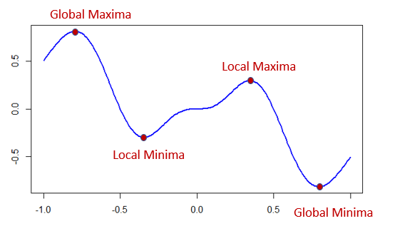<br>
[source](https://www.datasciencecentral.com/profiles/blogs/optimization-techniques-finding-maxima-and-minima)
]

- .blue[Objective function]: many minima/maxima

- Simplest methods get stuck in local minima

---
class: left, middle, inverse

# Outline

* .brown[The Problem]

* .cyan[Gradient Descent]

* Genetic Algorithms

* Examples

* References

---

# Gradient Descent

.center[
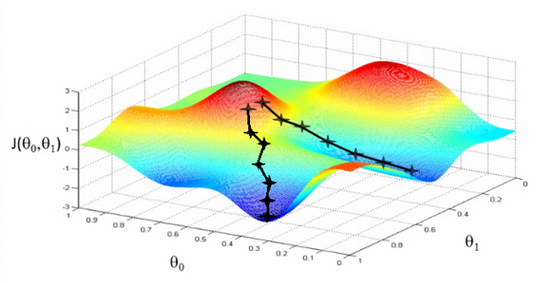<br>
[source](https://dzone.com/articles/gradient-descent-algorithm)
]

- Methafor: going down a mountain to the lowest point.

- Gradient (partial derivatives) gives the direction of steepest descent

---

# Hyperparameter: Step Size

.blue[Step size (η)]: factor to the gradient (arrow length)

- Too small: progress will be sloooooow

- Too big: it may jump over minima or go back and forth

- Can be adaptive (decrease with iterations)

.center[
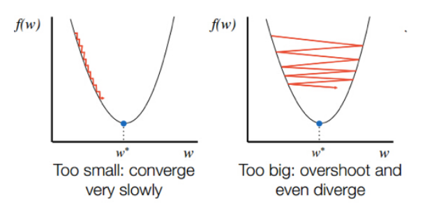<br>
[source](https://srdas.github.io/DLBook/GradientDescentTechniques.html)
]


---
class: left, middle, inverse

# Outline

* .brown[The Problem]

* .brown[Gradient Descent]

* .cyan[Genetic Algorithms]

* Examples

* References

---

# Genetic Algorithm I

Given a problem $P$ with a solution space $S$, the main components are:

- .blue[Chromosome] (solution): collection of .blue[genes] (parameters)

- .blue[Population]: collection of chromosomes

- .blue[Fitness function]: scores how good is a solution

- .blue[Selection]: selects best chromosomes

- .blue[Crossover]: from 2 random chromosomes & a random point:
  * requirements: $2\times n$ parents for each $n$ new chromosomes

.center[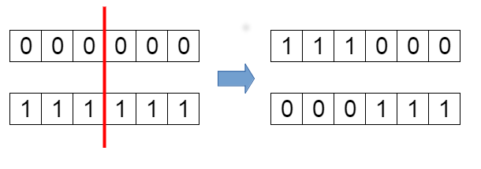]

---

# Genetic Algorithm II

- .blue[Mutation]: change a value
  - Probability of mutation (<10%)
  - Random index
  - Random number to add or substract

.center[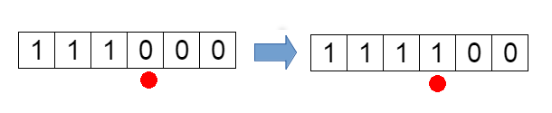]

**Algorithm:**

```
1. Random Population
2. Compute fitness
3. Selection 
4. Crossover
5. Mutation
6. Go to step 2
```
---

# Behavior

.center[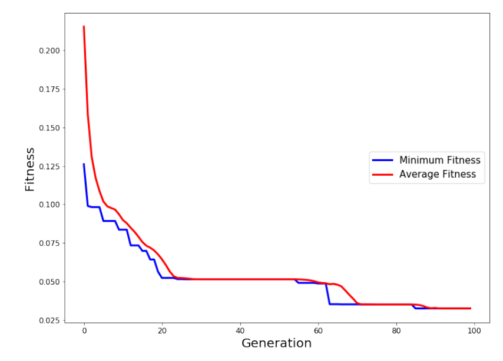]

---
class: left, middle, inverse

# Outline

* .brown[The Problem]

* .brown[Genetic Algorithms]

* .cyan[Examples]

* References

---

# Live Demo!

.blue[HTML_Genetic_Cars] in js:

.center[[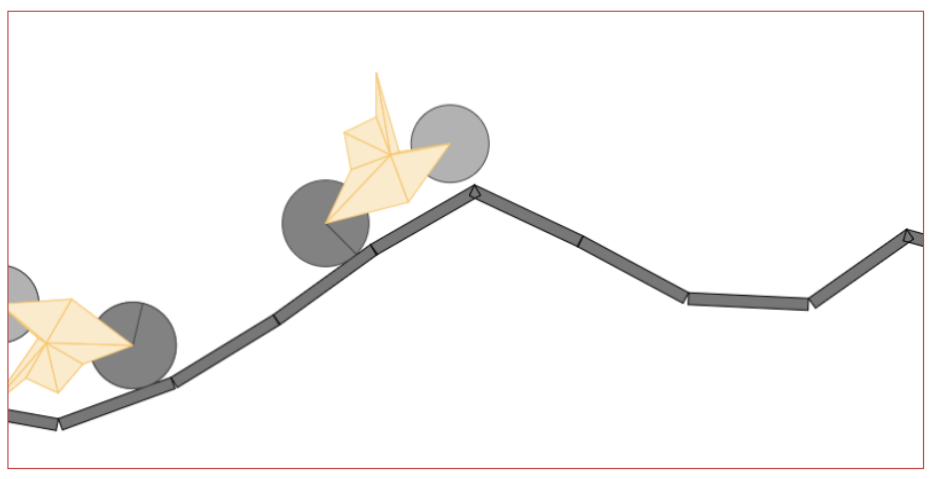](https://rednuht.org/genetic_cars_2/)]

- [web](https://rednuht.org/genetic_cars_2/) / [github](https://github.com/red42/HTML5_Genetic_Cars)

---

# Maze

.blue[Genetic Algorithm in Unity]:

.center[[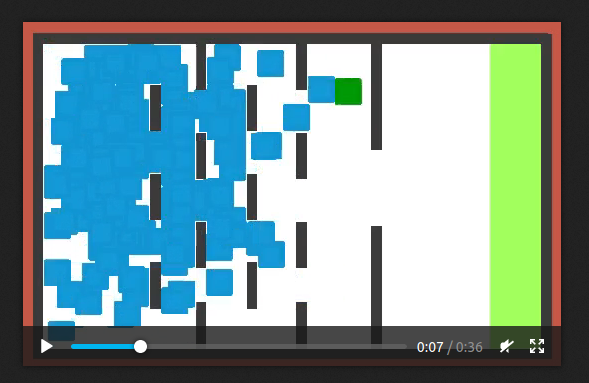](figures/maze.mp4)]

- [github](https://github.com/Sebastian-Schuchmann/Genetic-Algorithm-in-Unity3D)

---

# Training Neural Networks

with backpropagation and evolution based learning in Unity:

.center[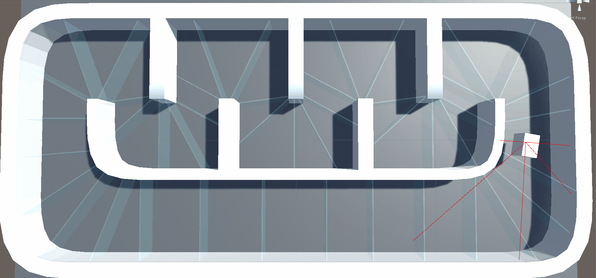]

- [Building a neural network framework in C#](https://towardsdatascience.com/building-a-neural-network-framework-in-c-16ef56ce1fef)

- [Mutation Project on Github](https://github.com/kipsterbro/MutationNetwork).

- [Backpropagation Project on Github](https://github.com/kipsterbro/BackPropNetwork).


---
class: left, middle, inverse

# Outline

* .brown[The Problem]

* .brown[Genetic Algorithms]

* .brown[Examples]

* .cyan[References]
---

# References

- Ian Millington. _AI for Games_ (3rd edition). CRC Press, 2019.

- Rafael Matsunaga. [Genetic Cars](https://rednuht.org/genetic_cars_2/), [github](https://github.com/red42/HTML5_Genetic_Cars). 

- Sebastian-Schuchmann. [Genetic Algorithm in Unity](https://github.com/Sebastian-Schuchmann/Genetic-Algorithm-in-Unity3D).

- Kip Parker. [Building a neural network framework in C#](https://towardsdatascience.com/building-a-neural-network-framework-in-c-16ef56ce1fef).

- Viktor Seč. [Karl Sims - Evolving Virtual Creatures With Genetic Algorithms](https://www.youtube.com/watch?v=bBt0imn77Zg). 1994.

- Thomas Geijtenbeek. [Flexible Muscle-Based Locomotion for Bipedal Creatures](https://www.youtube.com/watch?v=pgaEE27nsQw). 2013.

