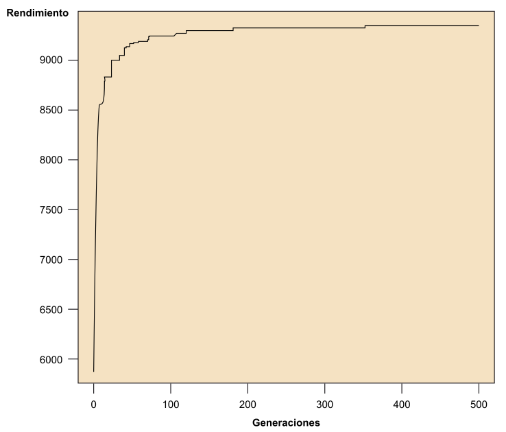

class: center, middle

## Artificial Intelligence

# Optimization for Games

<br>

Gerard Escudero & Samir Kanaan, 2019

<br>


.footnote[Source: [inverse](https://www.inverse.com/article/31467-artificial-intelligence-computer-human-game) ]

---
class: left, middle, inverse

# Outline

* .cyan[Genetic Algorithms]

* References

---

# Optimisation I

- **Problem**: setting parameters

- Example 1:

    - Strategy Game with diferent kind of units

    - Every unit have diferent attributes (attack, defense, life points)
 
    - All the units have to be useful

    - We need to balance them

- Example 2:

    - Game difficulty level adjustment

- Example 3:

    - Setting parameters of a Machine Learning algorithm

- Example 4:

    - Learning behaviour

---

# Optimisation II

- Exemple: Strategy Game

  - 10 unit types

  - 3 attributes (attack, defense, life)

  - 20 possible values (1..20)

  - possible combinations will be $20^{3\times 10}$

  - testing all combinations is impossible

- **Solution**: 

  - Find a _reasonably_ good solution in a limited time

  - .blue[Optimisation algorithms]

---

# Genetic Algorithm I

Given a problem $P$ with a solution space $S$, the main components are:

- .blue[Chromosome] (solution): collection of .blue[genes] (parameters)

- .blue[Population]: collection of chromosomes

- .blue[Fitness function]: scores how good is a solution

- .blue[Selection]: selects best chromosomes

- .blue[Crossover]: from 2 random chromosomes & a random point:
  * requirements: $2\times n$ parents for each $n$ new chromosomes

.center[]

---

# Genetic Algorithm II

- .blue[Mutation]: change a value
  - Probability of mutation (<10%)
  - Random index
  - Random number to add or substract

.center[]

.cols5050[
.col1[
**Algorithm:**

```
1. Random Population
2. Compute fitness
3. Selection 
4. Crossover
5. Mutation
6. Go to step 2
```

- Example: [demo](figures/maze.mp4) / [reference](https://github.com/Sebastian-Schuchmann/Genetic-Algorithm-in-Unity3D)
]
.col2[

]]


---
class: left, middle, inverse

# Outline

* .brown[Genetic Algorithms]

* .cyan[References]


