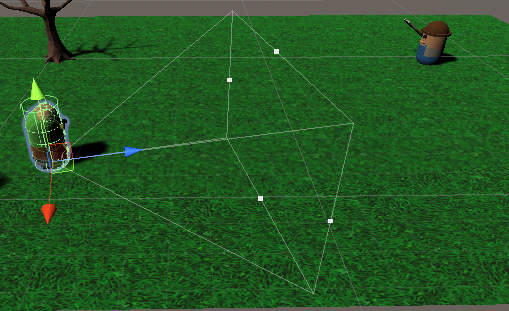

class: center, middle

## Artificial Intelligence

# World Interfacing & Knowledge

<br>

Gerard Escudero, 2020

<br>


.footnote[[Source](https://external-content.duckduckgo.com/iu/?u=https%3A%2F%2Fi.ytimg.com%2Fvi%2F8Jbvik4IA3o%2Fmaxresdefault.jpg&f=1&nofb=1)]

---
class: left, middle, inverse

# Outline

* .cyan[Perception]

* Interfacing

* Example

* Blackboards

* References 

---

# Perception

- There is a growing interest in the topic of perception.
  - Stealth games.

  - [Half-Life - Sense of Smell AI](https://www.youtube.com/watch?v=1tvz0WVaQGg).  MarphitimusBlackimus, 2017.

- They are not only attached to AI agents:
  - Camera, radio, sonar...

- Detection can have some delay (smelling)

- Detected elements fall in three categories:
  - Friendly: mates, birds...

  - Investigate: steps, blood...

  - Thread: alarm, dead body...

---

# Sight

.blue[Properties]:
- *Cone*: human angles 220x120 degrees
- Attention: we do not see all in scene <br>
(simulations reduce angle to 60º)
- *Line of Sight*: it need to have direct line<br>
Exception: mirrors
- *Distance*: convention to see only up to a certain distance
- *Shadows*: many games use them to hide

.blue[Implementation]:
- Field of view (distance & angle) and line of sight (raycast)
- Frustum (see example below)

.blue[Documentation]:
- [2d Visibility](https://www.redblobgames.com/articles/visibility/). Red Blob Games, 2012.
- [Frustum Culling](https://www.flipcode.com/archives/Frustum_Culling.shtml). Dion Picco, 2003.

---

.cols5050[
.col1[
# Hearing

.blue[Properties]:
- *Volume*
- *Distance*
- *Pitch*
- *Dampening*: areas that block or dampen sound (problem?)

.blue[Implementation]:
- Distance from source

# Smell

.blue[Properties]:
- *Distance*
- *Slow propagation*
- *Time*
]
.col2[
# Touch

.blue[Properties]:
- *Physical contact*<br>
Example: throwing a rock to a guard?

.blue[Implementation]:
- Collision detection

# Other Senses

- Sonar / Radar
- Infrared / Night Vision 
- Goblin Detector
- ...
]]


---
class: left, middle, inverse

# Outline

* .brown[Perception]

* .cyan[Interfacing]

* Example

* Blackboards

* References 

---

# Interfaces

*Interaction between game environment and the agents.*

.blue[Polling]: agent centered

- The AI search all the external information need for the task.

- fast, easy implementation, not scalable.

.blue[Event]: sensor centered

- When the event occurs an event manager sends the information to the affected agents.

- Too much work for simple situations.

- Needs some .blue[event manager].

- .blue[Emitters]: components for helping in element separation.<br>
Example: grenade $\rightarrow$ sound emitter


---

# Events

- Event queue design pattern (like SDL input)<br>
`List<type>` or `Queue<type>` in [System.Collections.Generic](https://docs.microsoft.com/en-us/dotnet/csharp/programming-guide/concepts/collections)
 

- Example Event declaration:
```
public class PerceptionEvent
{
    public enum senses { VISION, SOUND }; 
    public enum types { NEW, LOST };  
    public GameObject go;
    public senses sense;
    public types type;
}
```
- Other common properties:
  - `Thread level [friendly, suspicious, thread]`
  - `Distance [exact, range, unknown]`
  - `Direction [exact, range, unknown]`
  - `Description [object name, object type, unknown]`
  - ...

---
class: left, middle, inverse

# Outline

* .brown[Perception]

* .brown[Interfacing]

* .cyan[Example]

* Blackboards

* References 

---

# Vision Example

.cols5050[
.col1[
.blue[Zombies]: [example video](figures/zombies.mkv)

.blue[Unity Stuff]:

- Crowding implemented using `NavMeshAgent` components.

- Sensor implemented using the frustum of a camera component.<br>
[Example code](codes/vision.html)

- Simple event implementation<br>
(using Unity Messaging system)
  - `go.SendMessage` ([doc](https://docs.unity3d.com/ScriptReference/GameObject.SendMessage.html)): messaging & tags
  - `go.BroadcastMessage` ([doc](https://docs.unity3d.com/ScriptReference/Component.BroadcastMessage.html)): messaging & child objects

]
.col2[
.blue[Frustum example]:



.blue[Camera component properties]:
- `Clear Flags - Don't Clear`
- `Culling Mask - Nothing`
- `Field of View`
- `Clipping Planes - Far`
- `HDR - Off`
- `MSAA - Off`

]]

---
class: left, middle, inverse

# Outline

* .brown[Perception]

* .brown[Interfacing]

* .brown[Example]

* .cyan[Blackboards]

* References 

---

# Blackboards

*Mechanism for storing and sharing information between agents.*

- Perception systems represent just your senses.

- Some games needs to extend knowledge & reasoning.

.cols5050[
.col1[
### Knowledge categories

- .blue[Internal Knowledge]: in agent.

- .blue[External Knowledge]: global information.

- .blue[Shared Knowledge]: information from the group of the agent.
]
.col2[
### Blackboard Model

- Blackboard is the shared memory.

- Agents are called *experts* in blackboard language.

- *Arbiter*: for controlling which agent has control of the blackboard.
]]

---

# Knowledge Bits

- Data from sensors or calculated

- Contains attribute sets:
  - Data Name: “Player Position”, “HP”
  - Value: float / string / GameObject... 
  - Timestamp / caducity
  - Source agent
  - ...

## Data Structure

- Simple implementation: `Dictionary` (like STL maps)<br>
`Dictionary<type>` in [System.Collections.Generic](https://docs.microsoft.com/en-us/dotnet/csharp/programming-guide/concepts/collections)

---
class: left, middle, inverse

# Outline

* .brown[Perception]

* .brown[Interfacing]

* .brown[Example]

* .brown[Blackboards]

* .cyan[References]

---

# References

- Ian Millington. *AI for Games (3rd ed)*. CRC Press, 2019.

## Videos

- [Half-Life - Sense of Smell AI](https://www.youtube.com/watch?v=1tvz0WVaQGg).  MarphitimusBlackimus, 2017.

<!--

- [Assassin's Creed® Syndicate Parkour & Navigation Gameplay](https://www.youtube.com/watch?v=1Hc7gJnekOw). Andy Gilleand, 2015.

- [Commandos 3: Destination Berlin Walkthrough - Central Europe - Part III](https://www.youtube.com/watch?v=EJzKsUBqBD0).  Hazendeuce, 2010.
 
-->
