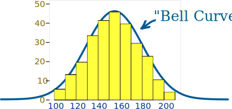

class: center, middle

## Artificial Intelligence

# Probabilities

 

Gerard Escudero, 2020

 

.footnote[[source](https://www.skepticalraptor.com/skepticalraptorblog.php/anti-vaccine-statistics-back-simple-math/) ]

---
class: left, middle, inverse

# Outline

* .cyan[Probability]

* Normal Distribution

* References

---

# Probability

.blue[How likely something is to happen.]

Values: from .blue[0] (impossible) to .blue[1] (certain)

$$P(\text{event})=\frac{\text{Outcomes event}}{\text{Total outcomes}}$$

Examples: 

.cols5050[
.col1[
- .blue[dice]

$$P(1)=\frac{1}{6}$$

- .blue[coin]

$$P(H)=\frac{1}{2}$$
]
.col2[
- .blue[king from a deck]

$$P(king)=\frac{4}{52}$$
]]

---

# Events

.blue[Complement]:

.cols5050[
.col1[
$$P(A)+P(A')=1$$
]
.col2[
.center[
 
[source](https://www.mathsisfun.com/data/probability-complement.html)
]]]

.blue[Independent]:

$$P(\text{1 or 2})=P(\text{1})+P(\text{2})=\frac{2}{6}$$

$$P(\text{\{1,1\}})=P(\text{1})*P(\text{1})=\frac{1}{6}\times\frac{1}{6}=\frac{1}{36}$$

---

# Dependent Events

.cols5050[
.col1[
$$P(\text{2 blues})=\frac{2}{5}\times\frac{1}{4}=\frac{2}{20}$$

$$P(\text{blue})=\frac{2}{5}$$

$$P(\text{blue}|\text{blue})=\frac{1}{4}$$

]
.col2[
.center[
 
[source](https://www.mathsisfun.com/data/probability-events-conditional.html)
]]]

.blue[Conditional Probability]: $P(A|B)$ $\rightarrow$ "A given B"

---

# Bayes' Theorem

.cols5050[
.col1[
$$P(A|B)=\frac{P(A)P(B|A)}{P(B)}$$
]
.col2[
$P(\text{man})=0.4$ 
$P(\text{pink})=0.25$ 
$P(\text{pink}|\text{man})=0.125$
]]

$$P(man|pink)=\frac{P(man)P(pink|man)}{P(pink)}=\frac{0.4\times 0.125}{0.25}=0.2$$

.blue[Principal component] of probabilistic Machine Learning algorithms.

.footnote[[source](https://www.mathsisfun.com/data/bayes-theorem.html)]

---
class: left, middle, inverse

# Outline

* .brown[Probability]

* .cyan[Normal Distribution]

  - Measures
  
  - Distributions

  - Standardization 

* References

---

# Data Distribution

.cols5050[
.col1[
.center[

]]
.col2[
Examples:
- heights of people
- size of things produced by machines (sugar)
- ...
]]

.footnote[[source](https://www.mathsisfun.com/data/standard-normal-distribution.html)]
---

# Measures

.blue[Mean]: average of the numbers

$$\mu=\frac{\sum_{i=1}^n x_i}{n}$$

.blue[Standard Deviation]: a measure of how spread out numbers are

.cols5050[
.col1[
$$\sigma=\sqrt{\frac{\sum_{i=1}^n (x_i-\mu)^2}{n}}$$
]
.col2[
$\pm1\sigma\rightarrow68\%$ 
$\pm2\sigma\rightarrow95\%$ 
$\pm3\sigma\rightarrow99.7\%$
]]
.center[]
.footnote[[source](https://studiousguy.com/real-life-examples-normal-distribution/)]

---

# Standardization

.blue[z-score]: 

$$z=\frac{x-\mu}{\sigma}$$

.blue[Standardization]: normalization

.center[
 
[source](https://www.mathsisfun.com/data/standard-normal-distribution.html)
]

- [Standard Normal Distribution Table](https://www.mathsisfun.com/data/standard-normal-distribution-table.html)

- [Practical example](https://www.mathsisfun.com/data/standard-normal-distribution.html)

---

# References

- MathIsFun.com. [Using and Handling Data](https://www.mathsisfun.com/data/index.html). Math is Fun, 2019.
   

## Probability Density Function

$$f(x)=\frac{1}{\sigma\sqrt{2\pi}}e^{-\frac{1}{2}\left(\frac{x-\mu}{\sigma}\right)^2}$$

