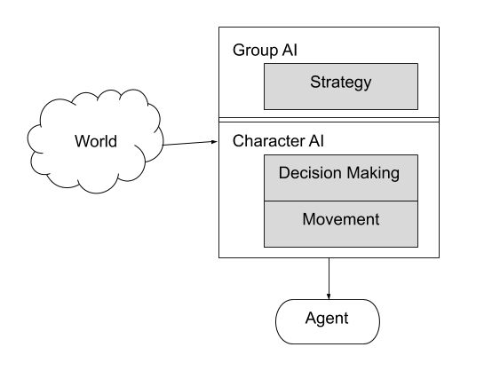

class: center, middle

## Artificial Intelligence

# Rule-Based Systems
## Decision Making

<br>

Gerard Escudero, 2020

<br>


.footnote[[source](https://fabiusmaximus.com/2018/02/14/women-hitting-men-grr-power/) ]

---
class: left, middle, inverse

# Outline

* .cyan[Introduction]

* Rule-Based Systems

* Examples in C#

* Functional Programming

* References

---

# Game AI Model



.blue[Decision Making] level

---

# Rule-Based Systems

- Symbolic AI research at 1980s
  - .blue[Expert Systems]

- Structure:
  - .blue[Database] containing knowledge
  - Set of .blue[rules] (*if-then-else*)

- Properties:
  - Most complex decision making system we have covered.
  - Easy justification of its reasonig <br>(allowing easy debugging).
  - Simplest can be encoded as Decision Trees.

.blue[Horizon Zero Dawn].red[*]:
- Pathfinding in Recast.
- Decision Making implemented in LISP.<br>Compiled to C++.

.footnote[.red[*] by [Guerrilla Games](https://www.guerrilla-games.com/).]

---

# Components I

  - .blue[Facts]:
```
Captain: health = 51
Johnson: health = 38
Sale: health = 42
Whisker: health = 15
Whisker: has-radio
```

  - .blue[Patterns] (boolean operators):
```
Whisker: health = 0 AND Whisker: has-radio
```

  - .blue[Matching]:
```
Anyone-1: health < 15 AND Anyone-2: health > 45
```
*Variables*. 

---

# Components II

  - .blue[Condition-Action Rules]:
```
IF Whisker: health = 0 AND Whisker: has-radio
THEN Sale: pick up the radio
```

  - .blue[Rewriting Rules]:
```
remove(Whisker has-radio)
add(Sale has-radio)
```

---
class: left, middle, inverse

# Outline

* .brown[Introduction]

* .cyan[Rule-Based Systems]

* Examples in C#

* Functional Programming

* References

---

# Inference Mechanisms

.blue[Forward Chaining]:

- Exhaustively appplication of rules while it can generate new facts.

.blue[Backward Chaining]:

- *goal-driven*: it works backwards from a specific fact to attempt to reach our initial database.

### Rule Arbitration

Several rules may trigger at the same time. Which one can fire?

- *First applicable*, *least recently used*, *random rule*


---

# Data Format in the Database

.blue[Datum]: single item in the database.

- Symbolic representation:
```
(identifier content)
```

- Hierarchical content:
```python
    (Captain 
        (Weapon 
            (Rifle (Ammo 36) (Clips 2)))
        (Health 65)
        (Position [21, 46, 92]))
```

- Variables (*wild cards*):
```
(?anyone (Health 0-15))
```

---

# Matching vs Unification

*Unification* is a generalization of *matching*:

```
(?person (health 0-15))
AND
(Radio (held-by ?person))
```

```
(Johnson (health 38))
(Sale (health 15))
(Whisker (health 25))
(Radio (held-by Whisker))
```

### Rete

Algorithm form matching rules against a database. 
- Most expert systems are based on Rete. <br>
Directed acyclic graph that contains a rules and its patterns.

---
class: left, middle, inverse

# Outline

* .brown[Introduction]

* .brown[Rule-Based Systems]

* .cyan[Examples in C#]

* Functional Programming

* References

---

# Robber with Rules

.cols5050[
.col1[
[video](figures/robber.mkv) / [code](codes/Rules.html) / [download](codes/Rules.cs)

.blue[Properties]:

- Datum: <br>
```
(approaching)
(stolen)
```
- Rule Arbitration:<br>
*First Applicable*

- Inference:<br>
Just a rule. No iteration.

- Structure:
```
HashSet<string> datum;
List<(Func<bool>,Action)> rules;
```
]
.col2[
.blue[C# stuff]:

- Lambda functions:
```
(x) => x + 1
```

- Lambda actions:
```
    (pos) => { 
        Seek(pos);
        }
```
- Messages:
```
gameObject.SendMessage("Hide"); 
```

]]

---

# Datum

.cols5050[
.col1[
.blue[HashSet]:
```
(stolen)
```

.blue[Dictionary]:
```
(health 65)
```

.blue[Hierarchical Dictionary]:
``` 
(whisker 
    (health 65)
    (ammo 236)
)
```

]
.col2[
.blue[Classes]:
```
(Captain 
    (Weapon 
        (Rifle (Ammo 36) (Clips 2)))
    (Health 65)
    (Position [21, 46, 92]))
```
Example:
```
class Datum
{
    string identifier;
    bool hierarchy;
    string content;
    List<Datum> childs;
}
```
]]

---

# Unification Example

.blue[Change the radio carrier]:

- Facts:
```
(Johnson (health 38))
(Sale (health 15))
(Whisker (health 25))
(Radio (held-by Whisker))
```

- Rule:
```
(?person (health 0-15))
AND
(Radio (held-by ?person))
```

- [code](codes/SimpleUnification.html) / [download](codes/SimpleUnification.cs) / [output](codes/output.txt)

---
class: left, middle, inverse

# Outline

* .brown[Introduction]

* .brown[Rule-Based Systems]

* .brown[Examples in C#]

* .cyan[Functional Programming]

* References

---

# Programming Languages

- .blue[Fortran] (1954-57): science

- .blue[LISP] (1958): AI research

- .blue[Algol] (1958): ancestor of Pascal, C, C++...

- .blue[Cobol] (1959): bussiness

- .blue[C] (1972): Unix Development

- ...

.cols5050[
.col1[
Imperative & OO:

- .blue[C++] (1979-1998)

- .blue[C#] (2000)

- .blue[Java] (1995)

- .blue[Python] (1991)
]
.col2[
Functionals:

- .blue[Scheme] (1975)

- .blue[Common Lisp] (1980)

- .blue[Clojure] (2005)

- .blue[Haskell] (1987-89)
]]
---

# Functional Paradigm

.cols5050[
.col1[
Characteristics:

- Procedural

- No notion of state

- No side effects

- Easier to reason about correctness

- Useful for Symbolic treatment

- Powerful type systems
]
.col2[
Key Concepts:

- Recursivitat:
```lisp
    (define (fib n)
      (cond
        ((= n 0) 0)
        ((= n 1) 1)
        (else
          (+ (fib (- n 1))
             (fib (- n 2))))))
```

- High Order Functions:
```haskell
    map(lambda x: 2*x, [1,2,3,4])
```

- Aplicació parcial (currying):
```haskell
    doble = (*2)
```
]]

.footnote[[source](https://jpetit.jutge.org/lp/02-introduccio.html)]

---

# Functional Programming Languages

.cols5050[
.col1[
## [Clojure](https://clojure.org/)

*Dialect of LISP*.

- Functional Programming Language.

- Compiled on Java frameworks.

- .blue[Clojure 1.0]: (2009)

## [Common Lisp](https://common-lisp.net/)

[Embedding Lisp in C++](https://chriskohlhepp.wordpress.com/advanced-c-lisp/embedding-lisp-in-cplusplus-a-recipe/)

]
.col2[
## [Haskell](https://www.haskell.org/)

*Evolution of functional programming.*

- Haskell 98 (1987-89)

- Haskell 2010 ([GHC](https://www.haskell.org/ghc/))

## [CLIPS](http://clipsrules.sourceforge.net/)

A Tool for Building Expert Systems

]]

---

# Haskell taste I

Expressions:
```haskell
λ> (3 + 2) * 2
 👉 10
```

Fibonacci:
```haskell
factorial :: Integer -> Integer
factorial 0 = 1
factorial n = n * factorial (n - 1)
```
```haskell
λ> factorial 5
 👉 120
λ> map factorial [0..5]
 👉 [1, 1, 2, 6, 24, 120]
```

.footnote[[source](https://jpetit.jutge.org/haskell/aperitiu.html)]

---

# Haskell taste II

QuickSort:
```haskell
quicksort []     = []
quicksort (p:xs) = (quicksort menors) ++ [p] ++ (quicksort majors)
    where
        menors = [x | x <- xs, x <  p]
        majors = [x | x <- xs, x >= p]
```
```haskell
λ> :type quicksort
 👉 quicksort :: Ord t => [t] -> [t]
λ> quicksort [5, 3, 6, 3, 1]
 👉 [1, 3, 3, 5, 6]
λ> quicksort ["joan", "sara", "pep", "jana"]
 👉 ["jana", "joan", "pep", "sara"]
```

.footnote[[source](https://jpetit.jutge.org/haskell/aperitiu.html)]

---

# Haskell taste III

Binary Trees:
```haskell
data BTree t = Empty
             | Node t (BTree t) (BTree t)

height :: BTree t -> Integer
height Empty = 0
height (Node x fe fd) = 1 + max (height fe) (height fd)

preorder :: BTree t -> [t]
preorder Empty = []
preorder (Node x fe fd) = [x] ++ preorder fe ++ preorder fd
```
```haskell
λ> let t = Node "a" (Node "b" (Node "d" Empty Empty) Empty) (Node "c" Empty Empty)
λ> height t
3
λ> preorder t
["a","b","d","c"]
```

.footnote[[source](https://jpetit.jutge.org/haskell/aperitiu.html)]

---

# Haskell taste IV

Infinity lists:
```haskell
fibs :: [Integer]
fibs = 0 : 1 : zipWith (+) fibs (tail fibs)
```
```haskell
λ> take 10 $ fibs
[0,1,1,2,3,5,8,13,21,34]
```


```haskell
primes :: [Integer]
primes = sieve [2..]
    where
        sieve (p : xs) = p : sieve [x | x <- xs, mod x p /= 0]
```
```haskell
λ> take 10 $ primes
[2,3,5,7,11,13,17,19,23,29]
```

.footnote[[source](https://jpetit.jutge.org/haskell/llistes-infinites.html)]

---

# Clojure taste I

Planning Routes:
```clojure
    (def flights
        '{teesside (amsterdam dublin heathrow)
          amsterdam (dublin teesside joburg delhi dubai)
          delhi (calcutta mumbai chennai)
          calcutta (mumbai kathmandu)
          mumbai (chennai delhi dubai)
          chennai (colombo)
          dubai (delhi colombo joburg)})
```
```clojure
user=> (breadth-search 'teesside 'colombo flights)
(teesside amsterdam dubai colombo)
```

.footnote[[source](https://cognesence.co.uk/downloads/Clojure_Tools_for_Practical_Artificial_Intelligence.pdf)]

---

# Clojure taste II

Pattern Matching:
```clojure
    (def food
        '([isa cherry fruit] [isa cabbage veg]
          [isa chili veg] [isa apple fruit]
          [isa radish veg] [isa leek veg]
          [color leek green] [color chili red]
          [color apple green] [color cherry red]
          [color cabbage green] [color radish red]))
```
```clojure
user=> (mfor ['[isa ?f veg] food] (? f))
(cabbage chili radish leek)
```
```clojure
user=> (mfor*['([isa ?f veg] [color ?f red]) food] (? f))
(chili radish)
```

.footnote[[source](https://cognesence.co.uk/downloads/Clojure_Tools_for_Practical_Artificial_Intelligence.pdf)]

---

# CLIPS taste

For example:
```clips
(defrule useful-rule "a useful rule"
        (animal fierce)
        (animal big)
        (animal hungry)
    =>
        (assert (run away))
    )
```

What this means is that if we have the following (unstructured) facts in our database
```clips
    (animal fierce)
    (animal big)
    (animal hungry)
```

then all of the preconditions have been met to fire useful-rule, and we assert (run away) into the database.

.footnote[[source](http://math.ups.edu/~matthews/STS350_S2006/CLIPS.htm)]

---

# Unity & Functional Programming

.cols5050[
.col1[
- .blue[Clojure & Arcadia] <br>
The integration of the Clojure Programming Language with the Unity 3D game engine. <br>
[docs](https://arcadia-unity.github.io/) / [github](https://github.com/arcadia-unity/arcadia)


- Haskell & C# <br>
[Foreign Function Interface](https://wiki.haskell.org/Foreign_Function_Interface) <br>
Compiling Haskell file as a shared Library <br>
[Calling Haskell from C#](https://stackoverflow.com/questions/16615641/calling-haskell-from-c-sharp)

- [CLIPS.NET](https://archive.codeplex.com/?p=clips)
]
.col2[
<br>
.red[[source](https://selfsame.itch.io/modern-dance)]
]]

---
class: left, middle, inverse

# Outline

* .brown[Introduction]

* .brown[Rule-Based Systems]

* .brown[Examples in C#]

* .brown[Functional Programming]

* .cyan[References]

---

# References

- Ian Millington. _AI for Games_ (3rd edition). CRC Press, 2019.

- Bret Ferrier. [MicroRuleEngine](https://github.com/runxc1/MicroRuleEngine), 2020.

- Microsoft. [Rules Engine](https://github.com/microsoft/RulesEngine), 2020.


- haskell.org. [Haskell](https://www.haskell.org/), 2014-20.

- Miran Lipovaĉa. [Learn You a Haskell or Great Good](http://learnyouahaskell.com/).

- Jordi Petit. [Programació Funcional en Haskell](https://jpetit.jutge.org/haskell/), 2020.


- Rich Hickey. [Clojure](https://www.clojure.org), 2008-19.

- Hirokuni Kim. [Clojure By Example](https://kimh.github.io/clojure-by-example/#about).

- Tims Gardner & Ramsey Nasser. [Arcadia Github](https://github.com/arcadia-unity/arcadia) ([wiki](https://github.com/arcadia-unity/Arcadia/wiki)), 2014-19.

- Simon Lynch & Saul Johnson. [Clojure Tools for Practical Artificial Intelligence](https://cognesence.co.uk/downloads/Clojure_Tools_for_Practical_Artificial_Intelligence.pdf), 2017.

- [CLIPS](http://www.clipsrules.net/)


