class: center, middle

## Artificial Intelligence

# Strategy & Tactics

 

Gerard Escudero, 2020

 

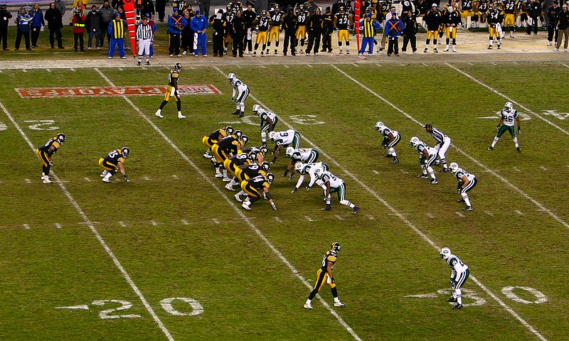

.footnote[[source](https://en.wikipedia.org/wiki/I_formation) ]

---
class: left, middle, inverse

# Outline

* .cyan[Introduction]

* Formation Motion

* Waypoint Tactics

* Tactical Analysis

* Tactical Pathfinding

* References

---

# Group AI

---

# Strategy vs Tactics

### .blue[Strategy]: 
General plan to achieve a goal (long time).

**Example**:  
Planning where to send the troops to win the war.

### .blue[Tactics]: 
Specific plan to achieve a particular goal (part of a strategy).

**Example**:  
How soldiers should run in a zig-zag pattern to decrease the chance of being shot.

.footnote[.red[Source]: [Diffen (Strategy vs Tactic)](https://www.diffen.com/difference/Strategy_vs_Tactic)]

---
class: left, middle, inverse

# Outline

* .brown[Introduction]

* .cyan[Formation Motion]

* Waypoint Tactics

* Tactical Analysis

* Tactical Pathfinding

* References

---

# Fixed Formations

.cols5050[
.col1[
**For simple formations.**

- .blue[Formation]: set of slots

- .blue[Slot]: location for an agent
  - 1 slot leader
  - rest of slots follow the leader  
$p_s=p_l+\Omega_l r_s$  
$\Omega_s=\Omega_l+\omega_s$   
$s$: slot  
$l$: leader  
$p$: position  
$\Omega$: orientation  
$r$: position to leader  
$\omega$: orientation to leader
]
.col2[
### Example:

- [video](figures/fixedFormation.mkv) / [code](codes/Formation.html) / [download](codes/Formation.cs) 
Other formations may require the rotation of the followers!

### Variants:

- .blue[Scalable Formations]
  - Depends on the number of members.
  - Example: defensive circles

- .blue[Emergent Formations]
  - Not all the members follow the leader (cascade)
  - Example: wedge formation
]]

---

# Slot Roles & Assignment I

- .blue[Slot Roles] are the typical RPG formations, in which every layer has a role:
  1. Melee warriors
  2. Arquers and Missile Magicians
  3. Magic and Healers

- They might need rearguard layers.

#### .blue[Approach 1: fixed slots]

- Given a fixed slot structure, an assignment of units has to be given:

.cols5050[
.col1[
.center[
| Cost | Magic | Missile | Melee |
|:-----|------:|--------:|------:|
| Ranger | 1000 | 0 | 500 |
| Warrior | 2000 | 1000 | 0 |
| Mage | 500 | 0 | 2000 |
| Healer | 0 | 1000 | 2000 |
(Millington, 2019)
]]
.col2[
.blue[Optimization process]

- Genetic Algorithm

- Fitness: $\sum_i cost_i$

| Melee | Missile | Magic | Melee |
|-------|---------|-------|-------|
| 3 | 2 | 1 | 2 |

]]

---

# Slot Roles & Assignment II

#### .blue[Approach 2: dynamic slots]

- Given a set of units, build a proper slot structure.
.cols5050[
.col1[
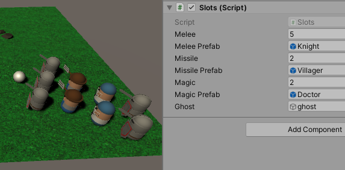
]
.col2[
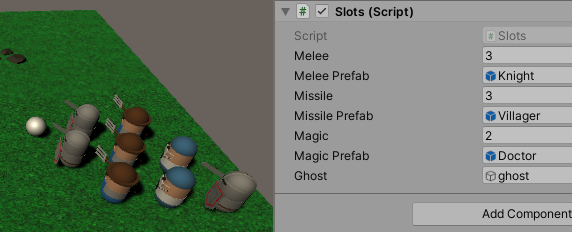
]]

- [Video](figures/slot.mkv) 

- [Spawner](codes/Slots.html) / [download](codes/Slots.cs)

- [Follower](codes/Formation2.html) / [download](codes/Formation2.cs)

---
class: left, middle, inverse

# Outline

* .brown[Introduction]

* .brown[Formation Motion]

* .cyan[Waypoint Tactics]

* Tactical Analysis

* Tactical Pathfinding

* References

---

# Tactical Locations

.blue[Tactical locations or waypoints]: 

- defensive locations, cover points, shadows...

- A location can be a compound tactic: set of primitive tactics  
Example: cover / shadow

.blue[Using tactical locations]:

- Previous algorithms: FSM, BTs, GOAP...

.blue[Generation of properties]: 

- Manually: level designer

- Automatic: raycast (visibility, cover), light maps (shadow)...
  
.blue[Generation of waypoints]: 

- Watching human players

- Waypoint Grids: test possible locations and choose the bests

---

# Example: BT for Cops Manager

.center[
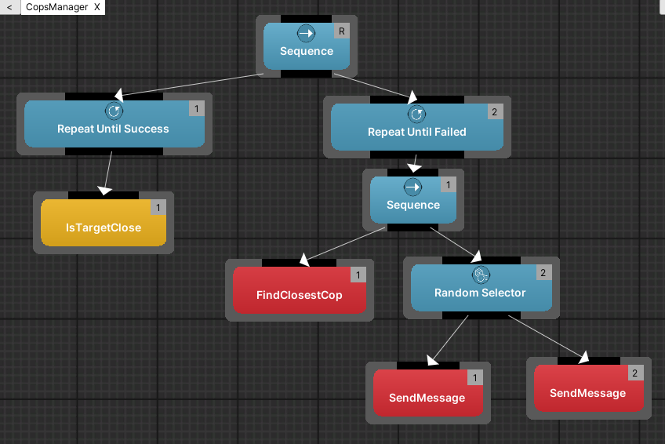
]

.cols5050[
.col1[
- [Video](figures/tacticBT.mkv)
]
.col2[
- [FindClosestCop](codes/BBFindClosestCop.html) / [download](codes/BBFindClosestCop.cs)
- [Cop](codes/Moves.html) / [download](codes/Moves.cs)
]]

---
class: left, middle, inverse

# Outline

* .brown[Introduction]

* .brown[Formation Motion]

* .brown[Waypoint Tactics]

* .cyan[Tactical Analysis]

  - .cyan[Influence maps]

  - Terrain Analysis

* Tactical Pathfinding

* References

---

# Influence Maps

*Track of current military influence of each location.*

.blue[Influence]:

.cols5050[
.col1[
$$I_d=\frac{I_0}{1+d}$$
]
.col2[
$I_0$: power of the unit

$d$: distance to the unit
]]

.blue[Applications]:

- Safe areas, areas to avoid, weakest border...

- Plan attack locations or movement guide

.blue[Dealing with unknowns]:

- Risk of underestimating forces (*fog-of-war*)

- Prediction of the enemy forces (Machine Learning)

---

# Example

Influence maps by Anomalous Underdog

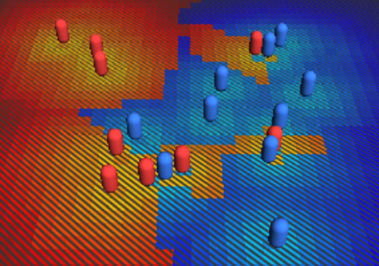

- [Video](figures/influenceMap.mkv) / [Reference](https://bitbucket.org/AnomalousUnderdog/influencemapsunity3d/src/Dev-Main/)

---
class: left, middle, inverse

# Outline

* .brown[Introduction]

* .brown[Formation Motion]

* .brown[Waypoint Tactics]

* .cyan[Tactical Analysis]

  - .brown[Influence maps]

  - .cyan[Terrain Analysis]

* Tactical Pathfinding

* References

---

# Terrain Analysis

*Extracting useful data from the structure of the landscape.*

- Covers, shadows, visibility...

- Algorithm: visite locations, calculate and annotate.

- Situations may change fast and they can have a high cost.

## Example:

.cols5050[
.col1[
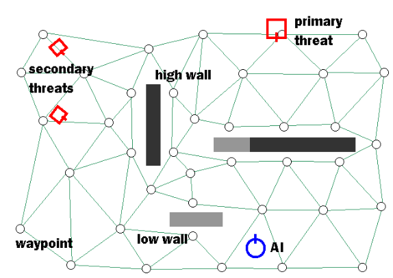
]
.col2[
[Killzone's AI: dynamic procedural combat tactics](https://www.cgf-ai.com/docs/straatman_remco_killzone_ai.pdf)

.blue[Initial situation]   (with legends)

]]

---

# Example

.cols5050[
.col1[
.blue[a) Distance nearby points]  
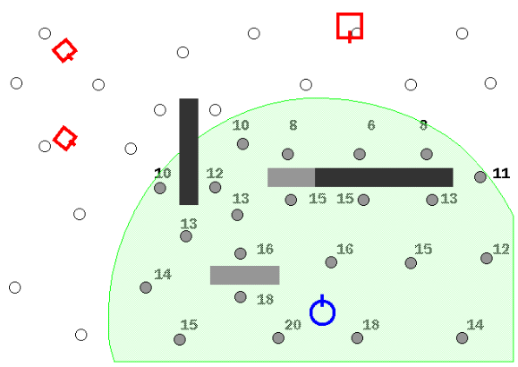

.blue[c) Line-of-fire secondary threats]  
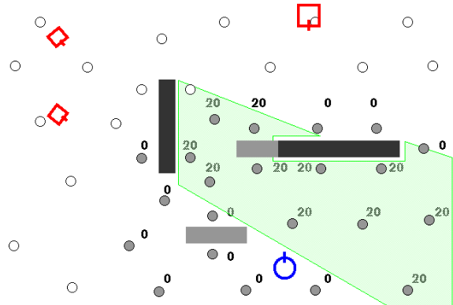

]
.col2[
.blue[b) Line-of-fire primary threat]  
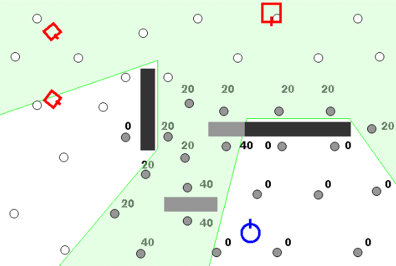

.blue[d) Preferred fighting range]  
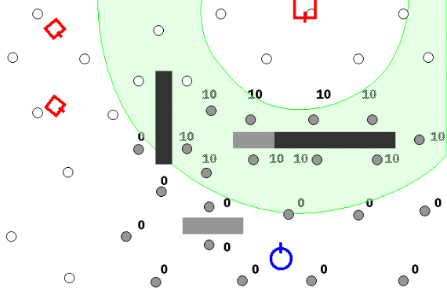
]]

.footnote[[Killzone's AI: dynamic procedural combat tactics](https://www.cgf-ai.com/docs/straatman_remco_killzone_ai.pdf)]

---

# Example

.blue[e) Adding all annotations yields best position]

.center[
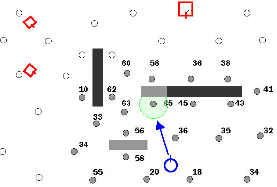
]

.footnote[[Killzone's AI: dynamic procedural combat tactics](https://www.cgf-ai.com/docs/straatman_remco_killzone_ai.pdf)]

---
class: left, middle, inverse

# Outline

* .brown[Introduction]

* .brown[Formation Motion]

* .brown[Waypoint Tactics]

* .brown[Tactical Analysis]

* .cyan[Tactical Pathfinding]

* References

---

# Tactical Pathfinding

.blue[Is shortest path the best path?]

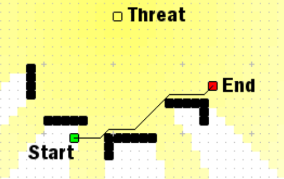
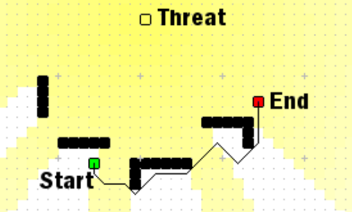.red[*]

.blue[Connection cost function]:

.cols5050[
.col1[
$$C=D+\sum_i w_iT_i$$
]
.col2[
$D$: distance  
$w$: weight  
$T$: tactic
]]

.footnote[.red[*] [Killzone's AI: dynamic procedural combat tactics](https://www.cgf-ai.com/docs/straatman_remco_killzone_ai.pdf)]
---
class: left, middle, inverse

# Outline

* .brown[Introduction]

* .brown[Formation Motion]

* .brown[Waypoint Tactics]

* .brown[Tactical Analysis]

* .brown[Tactical Pathfinding]

* .cyan[References]

---

# References

- Straatman, van der Sterren & Beij. [Killzone's AI: dynamic procedural combat tactics](https://www.cgf-ai.com/docs/straatman_remco_killzone_ai.pdf).

- Ferdinand Joseph Fernandez. [Influence Maps Unity 3d](https://bitbucket.org/AnomalousUnderdog/influencemapsunity3d/src/Dev-Main/), Anomalous Underdog, 2012.

- Ian Millington. _AI for Games_ (3rd edition). CRC Press, 2019.

- Ammobox Studios. [FPS/RTS Tactical AI in Unreal Engine 4.0](https://www.youtube.com/watch?v=uvVnwZmbFlo), 2014.

- Soren Johnson. [Playing to Lose: AI and "Civilization"](https://www.youtube.com/watch?v=IJcuQQ1eWWI), 2010.

- Damián Isla. [Building a Better Battle: The Halo 3 AI Objectives System](https://web.cs.wpi.edu/~rich/courses/imgd4000-d09/lectures/halo3.pdf), [audio](https://web.cs.wpi.edu/~rich/courses/imgd4000-d09/lectures/halo3.pdf), 2008.

- Alex J. Champandard. [The Core Mechanics of Influence Mapping](https://www.gamedev.net/tutorials/_/technical/artificial-intelligence/the-core-mechanics-of-influence-mapping-r2799/), [video](https://vimeo.com/23913640), 2011.

